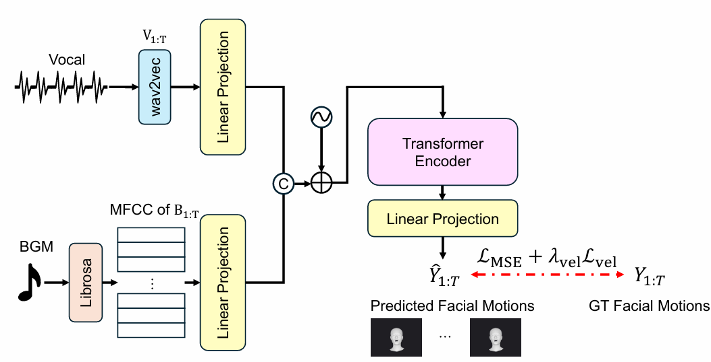
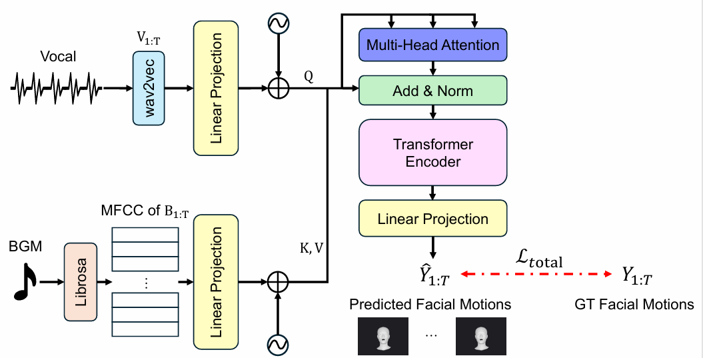

# Prediction of Singing Facial Motions from Musical Features

This research was carried out as part of the IMLEX program.

**What is the IMLEX program?** 

[ENGLISH](https://www.imlex.org/) | [JAPANESE](https://imlex.tut.ac.jp/)

This repository contains the implementation code for the singing facial expression estimation models proposed in this master's thesis, titled "Prediction of Singing Facial Motions from Musical Features." It implements two architectures, the Concatenation-based Model and the Cross-Attention-based Model, both of which take a singer's vocal audio and background music (BGM) as input and predict FLAME facial expression and head/neck pose parameters, which can then be rendered into a 3D singing animation.


## Dataset

This study uses the [SingingHead dataset](https://github.com/wsj-sjtu/SingingHead). SingingHead is a large-scale singing dataset that contains singing videos, vocal audio, BGM, and 3D FLAME facial parameters.

Among the data provided in SingingHead, this study uses the following three types of data:

- **Vocal audio**: Singing vocals (`.wav`)
- **BGM audio**: Accompaniment audio (`.wav`)
- **FLAME parameters**: FLAME parameters representing facial motion during singing (`.pkl`)

The FLAME parameters include **facial expressions (expression)** and **head and neck poses (global pose / neck pose)**. 

In this study, these parameters are used as prediction targets, while **jaw pose is excluded from the prediction target**.

## Overview

This repository implements two models for predicting singing facial motions from musical features: a Concatenation-based Model and a Cross-Attention-based Model.

Both models take vocal audio and BGM as inputs and predict FLAME facial parameters consisting of 50 expression parameters and 6 head/neck pose parameters.

### Concatenation-based Model



The vocal and BGM features are projected into the same feature space and
concatenated before being processed by the Transformer.

### Cross-Attention-based Model



The vocal features are used as queries, while the BGM features are used as keys and values in the cross-attention module. 


Ablation experiments are conducted to investigate the effects of **Positional Encoding (PE)** and the **Volume-based Stability Loss (VolStab)** in the loss function on prediction accuracy.

| Model | Positional Encoding | Volume-based Stability Loss | Training Script |
|---|:---:|:---:|---|
| Concatenation-based | ✓ |  | `scripts/train_code_wav2andMFCC/train.py` |
| Cross-Attention-based |  |  | `scripts/train_code_crossattention/train.py` |
| Cross-Attention-based | ✓ |  | `scripts/train_code_crossattention/train_v2.py` |
| Cross-Attention-based |  | ✓ | `scripts/train_code_crossattention/train_nope.py` |
| Cross-Attention-based | ✓ | ✓| `scripts/train_code_crossattention/train_add_volstab.py` |


## Repository Structure

```
IMLEX_Prediction_of_Singing_Face/
├── FLAME_PyTorch/                 # FLAME model
├── predictions/                   # Directory for storing prediction results
├── rendering_result/              # Rendered videos of prediction results
├── scripts/                       # Scripts for training, inference, and feature extraction
├── calculate_model_performance.py # Utility for measuring model size, number of parameters, and throughput
├── evaluation.py                  # Quantitative evaluation (MSE, MAE, PPE, velocity error, jitter, and Beat Align score)
├── output_mixedwav.py             # Mixes vocal and BGM audio to create audio for rendered videos
├── rendering.py                   # Outputs predicted FLAME sequences as MP4 videos with audio
└── requirements.txt               # Python dependencies
```

### Citation
```bibtex
@article{wu2023singinghead,
  title={Singinghead: A large-scale 4d dataset for singing head animation},
  author={Wu, Sijing and Li, Yunhao and Zhang, Weitian and Jia, Jun and Zhu, Yucheng and Yan, Yichao and Zhai, Guangtao and Yang, Xiaokang},
  journal={arXiv preprint arXiv:2312.04369},
  year={2023}
}
@article{chung2025audio2face,
  title={Audio2face-3d: Audio-driven realistic facial animation for digital avatars},
  author={Chung, Chaeyeon and Fedorov, Ilya and Huang, Michael and Karmanov, Aleksey and Korobchenko, Dmitry and Ribera, Roger and Seol, Yeongho and others},
  journal={arXiv preprint arXiv:2508.16401},
  year={2025}
}
@inproceedings{siyao2022bailando,
  title={Bailando: 3d dance generation by actor-critic gpt with choreographic memory},
  author={Siyao, Li and Yu, Weijiang and Gu, Tianpei and Lin, Chunze and Wang, Quan and Qian, Chen and Loy, Chen Change and Liu, Ziwei},
  booktitle={Proceedings of the IEEE/CVF conference on computer vision and pattern recognition},
  pages={11050--11059},
  year={2022}
}
```
